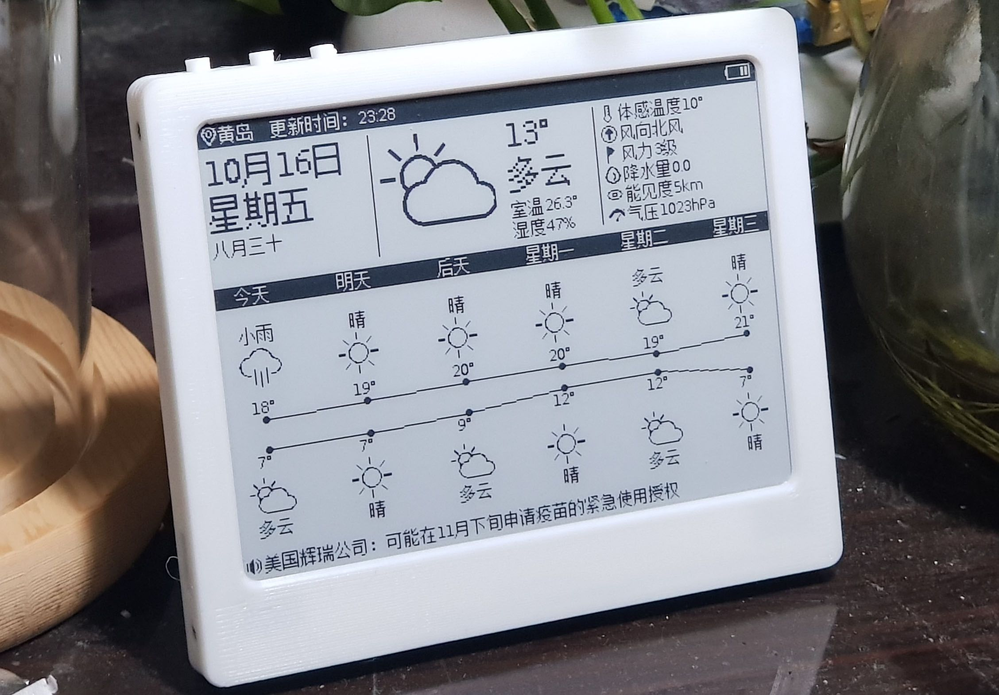
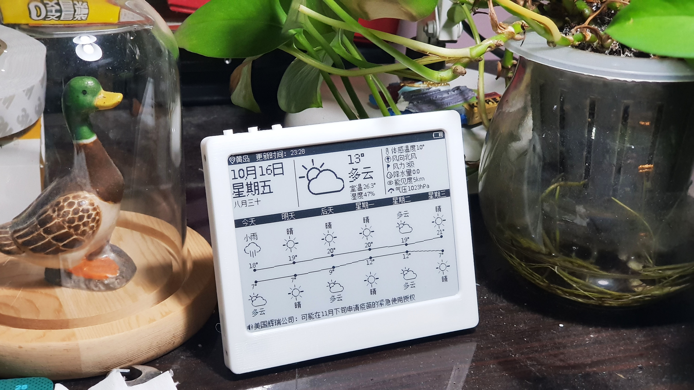
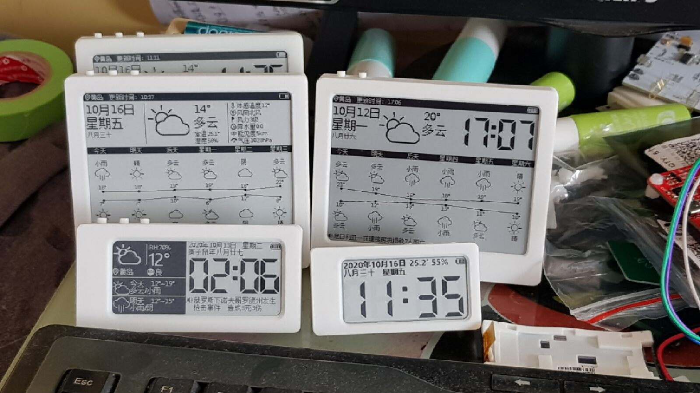
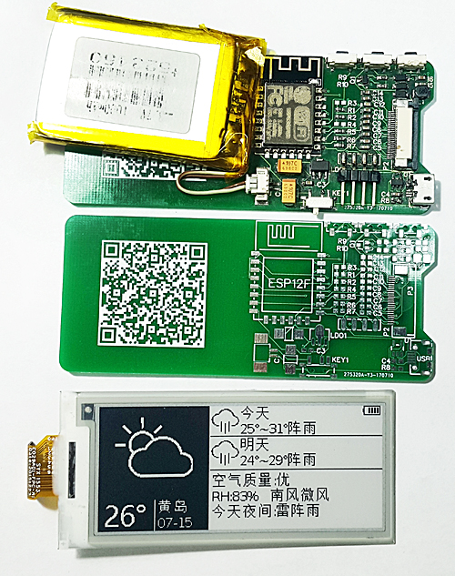
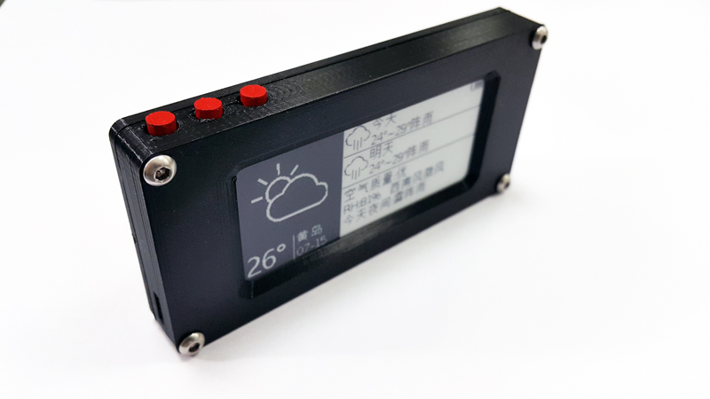
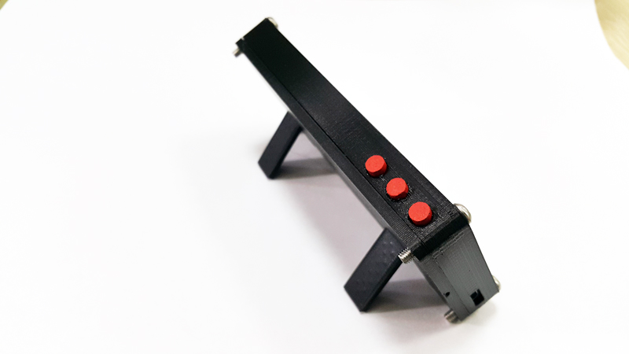

# ESP8266 E-Paper Weather Station / Calendar

> [!IMPORTANT]
> ## 4.2-Inch E-Paper Calendar Hardware Project
> **PCB, BOM, enclosure, firmware attachments, and build notes:** 
> **[Open the 4.2-inch E-Paper Calendar on OSHWHub](https://oshwhub.com/duck/4-2-cun-mo-shui-ping-ri-li)**

| 4.2-inch hardware | Multiple display sizes and layouts |
| --- | --- |
|  |  |

This repository contains the latest source code for an ESP8266 NodeMCU v2 e-paper weather station. The device can display weather forecasts, time, date, lunar-calendar information, indoor temperature and humidity, battery status, and custom messages. Partial e-paper refreshes and ESP8266 deep sleep are used to minimize average power consumption.

## Codex-Assisted Improvements

In August 2026, Codex helped review and update the networking, display, low-power, and reliability code. The main changes are:

- **Direct QWeather access:** the firmware now connects directly to QWeather. Each user can configure a personal API Host, API Key, and Location without depending on the original relay server.
- **Bounded network activity:** weather requests, network-time updates, retries, and recovery paths use timeouts and backoff so a failed network or API cannot keep the ESP8266 awake indefinitely.
- **Lower-power wake cycles:** Wi-Fi, SPI, and e-paper high-voltage power sequencing was tightened. Wake cycles that do not require networking can keep RF disabled, while failure and timed-refresh paths spend less time awake.
- **Timed partial-refresh fixes:** the WF32 clock path now preserves sub-second time across deep sleep, corrects clock drift, and separates partial refresh, panel shutdown, and sleep-to-next-minute into a bounded two-stage sequence.
- **Faster rendering:** WF32 frame transfer, framebuffer inversion, text rendering, and XBM raster composition were optimized to reduce per-pixel work, temporary strings, and unnecessary `yield()` calls.
- **Display and settings cleanup:** display paths for several 2.9, 3.2, 4.2, and 5.8-inch panels were normalized. The 4.2-inch date layout and weather-setting validation were also corrected.
- **Regression coverage:** a host-side raster test compares the optimized renderer against the original pixel renderer. All 8,208 XBM drawing cases match byte for byte. The current NodeMCU v2 firmware also compiles with Arduino IDE 1.8.9 and ESP8266 core 3.1.2.

See [`docs/PROJECT.md`](docs/PROJECT.md) for the implementation overview, build environment, and hardware-specific risks.

## Features

- Current weather and multi-day forecast
- Date, weekday, and lunar-calendar display
- Optional time display with partial refresh
- Indoor temperature and humidity display on supported hardware
- Battery-voltage indicator and low-voltage protection
- Configurable weather-update interval and active update window
- Phone-friendly local configuration portal
- Full Unicode font support through fonts stored on the device filesystem
- Custom-message display support
- Deep sleep between updates

## Hardware Projects and Community

- **Recommended 4.2-inch hardware:** [4.2-inch E-Paper Calendar on OSHWHub](https://oshwhub.com/duck/4-2-cun-mo-shui-ping-ri-li)
- **Earlier 2.9-inch PCB:** [ESP8266 E-Paper Weather Station on OSHWHub](https://oshwhub.com/duck/esp8266-weather-station-epaper)
- **Community:** QQ group 556951885

The 4.2-inch project page contains the PCB design, BOM, enclosure archive, firmware attachments, and additional build information.

## Supported Displays

The firmware contains drivers and layouts for several e-paper controllers and panel sizes. Check the manufacturer and model printed on the display flex cable before selecting a screen type in the configuration portal.

- 2.9-inch HINK, WF, DKE, and WFT0000BZ03 variants
- 3.2-inch WF32
- 4.2-inch HINK/OPM, DKE, and WF variants
- 5.8-inch WF58

Waveshare and Good Display sell modules, but the underlying panel may be produced by HINK, WF, DKE, OPM, or another manufacturer. The flex-cable marking is more useful than the module brand when choosing a driver.

## Basic Hardware

1. A supported e-paper panel
2. ESP8266 NodeMCU/Wemos board or the integrated PCB from the hardware project
3. Li-Po battery
4. Low-quiescent-current 3.3 V regulator for battery-powered builds
5. Enclosure appropriate for the selected display size

NodeMCU development boards commonly include an AMS1117 regulator and CP2102 USB-to-serial converter. Their combined quiescent current is too high for an efficient long-term battery build. Use the integrated PCB or another low-power design when battery life matters.

## Display Wiring

| E-Paper Signal | ESP8266 GPIO |
| --- | ---: |
| BUSY | GPIO4 |
| RST | GPIO2 |
| DC | GPIO5 |
| CS | GPIO15 |
| CLK | GPIO14 |
| DIN | GPIO13 |

Connect ESP8266 GPIO16 to RST so the internal deep-sleep timer can wake the chip.

## Build and Upload

- Main sketch: `WeatherStation-epaper-remote.ino`
- Target: ESP8266 NodeMCU v2
- Verified toolchain: Arduino IDE 1.8.9 with ESP8266 core 3.1.2
- Existing build parameters: `.build/build.options.json` in the development workspace

Compile and upload the main sketch with the verified ESP8266 toolchain. Upload the required files from `data/` to the ESP8266 filesystem using a filesystem uploader compatible with ESP8266 core 3.1.2.

The upstream ESP8266 Arduino documentation is available at:

- [ESP8266 Arduino core](https://github.com/esp8266/Arduino)
- [ESP8266 filesystem documentation](https://arduino-esp8266.readthedocs.io/en/latest/filesystem.html)

## Device Configuration

When configuration mode is active, connect a phone or computer to the `Epaper Weather Station` access point and open `http://192.168.4.1/`.

Configure at least:

- Wi-Fi SSID and password
- QWeather API Host
- QWeather API Key
- City or location
- E-paper panel type
- Time-display option
- Weather-update interval and active update window

Wi-Fi credentials and the QWeather API Key are stored on the device. Do not add credentials or generated configuration files to this repository.

## Weather Data

The current firmware connects directly to QWeather over HTTPS. It performs location lookup, current-weather, multi-day forecast, and air-quality requests using the credentials entered in the device portal.

DNS, connection, header, and body reads are bounded. RTC-backed retry state prevents repeated API or network failures from causing long high-power wake cycles.

## Fonts and Localization

The firmware converts UTF-8 strings to Unicode code points for display with `DrawUTF`. Font files are stored in the ESP8266 filesystem. A complete 16-by-16 Unicode font can consume about 2 MB, so builds that need only a limited character set should generate a smaller font.

The original font-generation project is available at [duck531a98/font-generator](https://github.com/duck531a98/font-generator).

## Custom Messages

The firmware retains custom-message display support. The original public relay is no longer included in this repository, so this feature requires a compatible service under your control.

## Low-Power Notes

- Deep-sleep current depends heavily on the regulator, USB-to-serial converter, pull-ups, sensors, and e-paper power circuit used by the hardware.
- E-paper BUSY waits and high-voltage shutdown paths must remain bounded to prevent a failed panel from draining the battery.
- Software time advances across deep sleep using planned sleep duration and is resynchronized during network-enabled wake cycles.
- Weather-only operation can run much longer than minute-by-minute time display because it requires far fewer wake and refresh cycles.

## Changelog

### 2026-08-17

- Imported the latest firmware source code.
- Added direct personal QWeather API configuration.
- Completed the Codex-assisted reliability, rendering, timekeeping, and low-power improvements described above.
- Verified the NodeMCU v2 build and 8,208 raster regression cases.

### 2020-05-14

- Updated the online PCB version. Some older explanations and photos below may no longer represent the current firmware.

### 2015-05-28

1. Changed the voltage-divider resistors from 1 MOhm/300 kOhm to 300 kOhm/100 kOhm (R6/R7).
2. Updated the battery-voltage calculation.
3. Stopped updates and displayed a warning when battery voltage fell below 3.4 V.

Calibrate the ADC for your own board because ESP8266 ADC readings can vary significantly.

## Earlier Project Photos

## Credits

Thanks to Mike, Daniel, and Fred for their work on ESP8266 weather stations, JSON parsing, e-paper hardware, and the original project ecosystem.

## License

This repository is distributed under the terms in [`LICENSE`](LICENSE).
